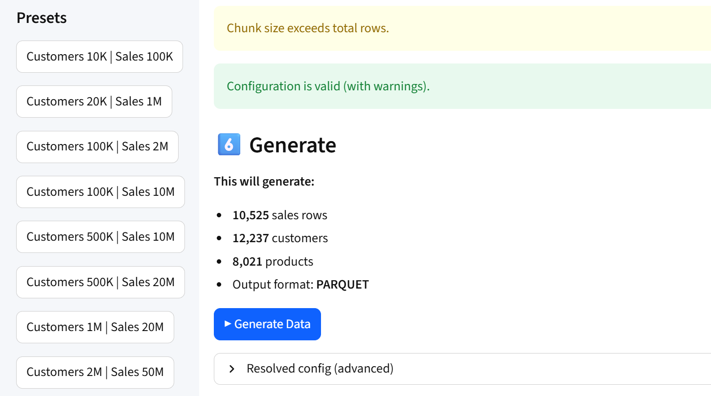
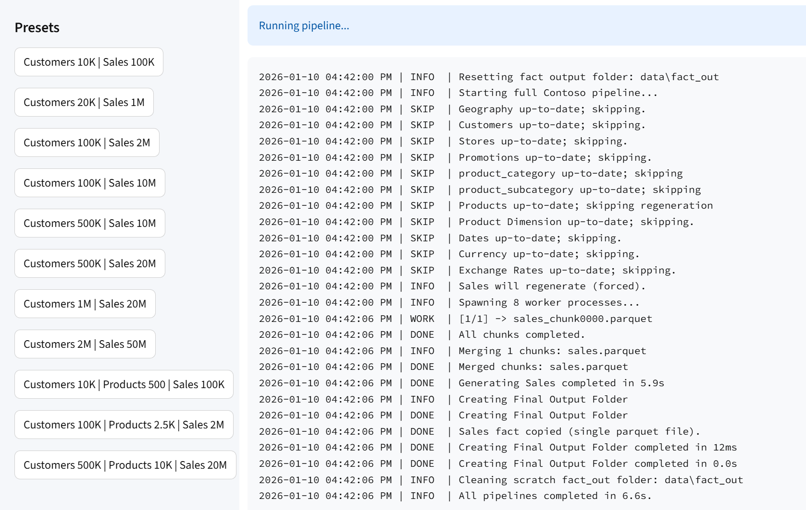

# Synthentic Data Generator (Contoso-based)

Generate a complete, **analytics-ready retail dataset** inspired by **ContosoRetailDW**, with scalable products and realistic sales behavior suitable for BI, analytics, and modeling scenarios.

The generator is designed to be **deterministic**, **schema-stable**, and **idempotent**, making it appropriate for repeatable demos, training, and benchmarking.


## Prerequisites

* **Python 3.10 or later**
* Git

Optional:

* Power BI Desktop (for analysis and modeling)

Verify your Python version:

```bash
python --version
```

## How to use

Clone the repository:

```bash
git clone https://github.com/SharmaAntriksh/synthetic-data-generator.git

cd synthetic-data-generator
```

Create virtual environment and install libraries:

```powershell
.\scripts\create_venv.ps1
```

Update virtual environment (if required):

```powershell
.\scripts\sync_venv.ps1
```

Activate virtual environment:

```powershell
. .\scripts\activate_venv.ps1
```

Edit parameters in `run_generator.ps1` and execute:

```powershell
.\scripts\run_generator.ps1
```

Run directly via CLI:

```powershell
python main.py --format csv --skip-order-cols false --sales-rows 4351 --customers 800 --stores 300 --products 500 --promotions 150 --start-date 2023-06-01 --end-date 2024-12-31 --workers 6 --chunk-size 2000000 --clean
```

Or run via the web interface

```powershell
.\scripts\run_ui.ps1
```





<h2>Output Folder</h2>


<h3>CSV</h3>


<hr />


<hr />

<h3>Parquet</h3>


<hr />

<h3>Delta Parquet</h3>


<h2>Power BI Data Model</h2>

<h3>Collapsed</h3>


<h3>Expanded</h3>


